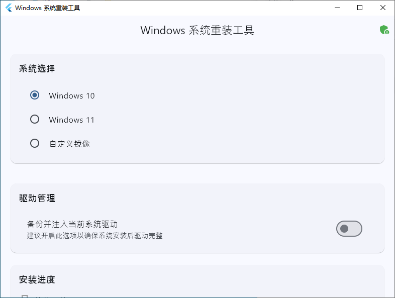

# Windows系统重装工具 (ReinstallSystem)

## ⚠️ 重要警告

> **在开始使用本工具之前，请务必仔细阅读以下内容：**
> - 系统重装将会清除系统盘上的所有数据，请确保已备份重要文件
> - 重装过程中请勿断电或强制关机，以免造成系统损坏
> - 本工具需要管理员权限才能运行
> - 建议在操作前仔细阅读使用说明

## 📝 项目简介

ReinstallSystem是一款基于Flutter开发的图形界面工具，旨在为用户提供简单、直观、高效的Windows系统重装体验。



## ✨ 核心功能

- **系统版本支持**
  - Windows 10 所有版本
  - Windows 11 所有版本

- **镜像格式支持**
  - ISO镜像文件
  - WIM格式文件
  - ESD格式文件

- **安装进度监控**
  - 实时进度显示
  - 安装状态提示

- **特色功能**
  - 一键系统重装

## 🔧 系统要求

### 运行环境
- Windows 10 1809 或更高版本
- Windows 11 所有版本

### 硬件要求
- 处理器：1.0 GHz 或更快
- 内存：2 GB RAM（64位）
- 硬盘空间：至少30GB可用空间

### 权限要求
- 需要管理员权限

### 网络要求
- 联网环境（用于下载系统镜像，非必需）
- 支持离线使用

## 📦 安装和使用

### 下载安装
1. 从[发布页面](https://github.com/XiaY-Summer/ReinstallSystem/releases)下载最新版本
2. 解压下载的压缩包
3. 双击运行`Open.exe`

### 基本使用流程
1. 选择系统镜像
2. 配置安装选项
3. 确认安装信息
4. 开始安装过程

## 🛠️ 开发相关

### 开发环境配置
```bash
# 安装Flutter SDK
flutter version 3.16.0 或更高版本

# 安装依赖
cd win_installer_gui
flutter pub get

# 运行开发版本
flutter run -d windows
```

### 主要依赖项
- Flutter Windows SDK
- window_manager: ^0.3.0
- provider: ^6.0.0
- path_provider: ^2.0.0

## ⚠️ 注意事项

### 数据安全
- 重装前务必备份重要数据
- 建议使用外置存储设备备份
- 确保备份文件的完整性

### 安装过程
- 保持电源连接
- 关闭杀毒软件
- 预留足够的磁盘空间

## 🏗️ 技术架构

### 前端架构
- 使用Flutter框架开发UI界面
- 采用Provider状态管理方案
- Material Design设计规范

### 后端实现
- 基于Windows Native API
- WinPE环境支持（需修改脚本）
- 系统API调用封装

### 核心组件
- 镜像处理模块
- 驱动管理系统
- 分区管理工具
- 安装引擎

## 🔍 故障排除

### 常见问题
1. 工具无法启动
   - 检查是否以管理员身份运行
   - 验证系统版本兼容性
   - 确认安装包完整性

2. 安装过程中断
   - 检查磁盘空间
   - 查看系统日志
   - 确认权限设置

**免责声明：** 使用本工具进行系统重装操作的风险由用户自行承担。开发者对因使用本工具而可能造成的数据丢失或系统损坏不承担责任。
